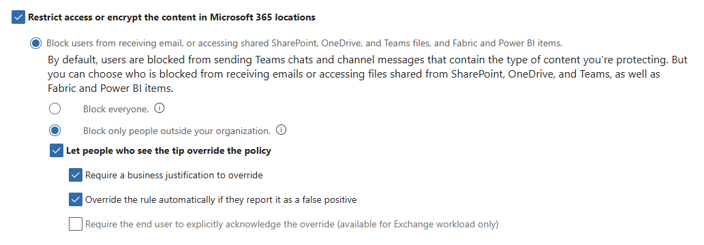

# Lab 02: Stop the Leak: DLP Policy & Policy Tips Across M365

## Lab Duration: 45-60 minutes

## Lab Objectives

- Create a Data Loss Prevention policy that covers Exchange, SharePoint/OneDrive, and Teams chat/files.
- Trigger policy tips using safe test content (no real PII).
- Observe alerts and understand investigator workflows.

## Prerequisites

- Exchange Online, SharePoint/OneDrive, Teams enabled
- Two test users (a sender and a reviewer/admin)
- Optional: An external email to demonstrate “outside the org” (you can also target any non-tenant domain like example.com).

---

## Lab Instructions

### 1. Safe Test Data (Copy/Paste)

**Activity:**

Create a text file "SensitiveTest.txt" with the following (intentionally designed to trigger DLP with built-in info types):

```Text
This document includes test data:
- US Social Security Number: 123-45-6789
- Visa Test Card: 4111 1111 1111 1111
- Keywords: SSN, Social Security, Credit Card
(Training text for DLP demonstration only.)
```

---

### 2. Verify Details for Sender and Reviewer/Admin Users

**Activity:**

1. Microsoft 365 admin center (<https://admin.microsoft.com>) → Users → Active users → Add a user (if needed)
2. Assign an E5 (or equivalent) license that includes Exchange, SharePoint/OneDrive, and Teams to both users
3. Sign in once as each user (newly created accounts) to complete first-run setup
4. Role intents:
    - Sender: regular user; no special roles needed
    - Reviewer/Admin: needs to create/edit DLP and view alerts (and optionally receive incident emails)

---

### 3. Grant Reviewer/Admin Required Purview Permissions

**Activity:**

1. Log in to the Microsoft Purview portal (<https://purview.microsoft.com>)
2. Navigate to Solutions → Roles and scopes → Role groups
3. Add the Reviewer/Admin user as a Member to the following groups:
    - Communication Compliance Administrators → allows creating and editing DLP policies and rules
    - Compliance Administrator → broad admin for Purview features, including Alerts (simplifies class setup)
    - (Alternative for read-only viewing): Compliance Compliance Viewers if you want them to view but not edit DLP
4. Save changes
5. **Note:** Permission changes may not take effect immediately. If access seems missing, sign out/in and retry.
6. Quick verification:
    - As Reviewer/Admin, open Compliance portal → Data loss prevention → you should see Policies and Alerts
    - As Sender, you can access Outlook, OneDrive/SharePoint, and Teams

---

### 4. Create DLP Policies

**Activity:**

1. In the Compliance portal, go to Data loss prevention → Policies → Create policy
2. Select "Data stored in connected sources" and click "Next"
3. Template: choose Financial, then pick U.S. Financial Data; click "Next"
4. Give your new policy a name (e.g. "Sensitive-US-Financial-Data") and, optionally, a description; click "Next"
5. On the "Assign admin units" page, leave defaults and click "Next"
6. On the "Choose where to apply the policy" page, verify that all locations are selected and click "Next"
7. For "Define policy settings", leave the default and click "Next"
8. On the "Info to protect" page, click "Next"
9. For "Protection actions", leave the defaults and click "Next"
10. For "Customize access and override settings", explore the available options
11. For this lab, select "Restrict access or encrypt the content in Microsoft 365 locations" and use the following settings:



12. Click "Next"
13. For "Policy mode", leave "Run the policy in simulation mode" selected and check "Show policy tips while in simulation mode"; click "Next"
14. On "Review and finish", click "Submit", then "Done"
15. Repeat that set of steps to create a policy called "Sensitive-US-PII-Data" using the "Privacy" template category and the "U.S. Personally Identifiable Information (PII) Data Enhanced" regulation

---

### 5. Test in Exchange (Email)

**Activity:**

1. Sign in as the Sender
2. Compose an email to <someone@external-example.com> (any non-tenant domain) with subject “Quarterly report” and attach or paste SensitiveTest.txt
3. Observe the policy tip
4. Send the email - notice that you receive notifications as the Sender that highlight violation of the credit card policy
5. Modify "SensitiveTest.txt" to remove the credit card number
6. Try sending the attachment to an external email again - this time the credit card policy tip will not show
7. If the PII data policy sync was complete (in can take a couple of hours) it would be matched as the next DLP policy in priority order

---

### 6. Test in SharePoint/OneDrive

**Activity:**

1. Sign in as the Sender
2. Add the fake credit card number back into "SensitiveTest.txt"
3. Upload "SensitiveTest.txt" to OneDrive or a SharePoint library
4. Notice the notification attached to the uploaded document about it potentially containing sensitive information
5. Try removing the sensitive detail and notice the results

---

### 7. Test in Teams

**Activity:**

1. In a 1:1 chat or channel, upload SensitiveTest.txt or paste the SSN/CC text
2. Confirm notifications sent to the sender

---

### 8. Optional: Switch the Policy from Notification to Enforcement

1. Navigate to each policy in DLP in Purview
2. Edit each policy
3. Click "Next" until you arrive at the "Policy mode" page
4. Click "Turn the policy on immediately"
5. Click "Next", click "Submit", and click "Done"
6. **NOTE:** The updates to the policy can take some time to reflect in the environment so "immediately" is a relative term in this case :)

---

### 9. Cleanup

1. Delete each of the policies added to DLP in Purview
