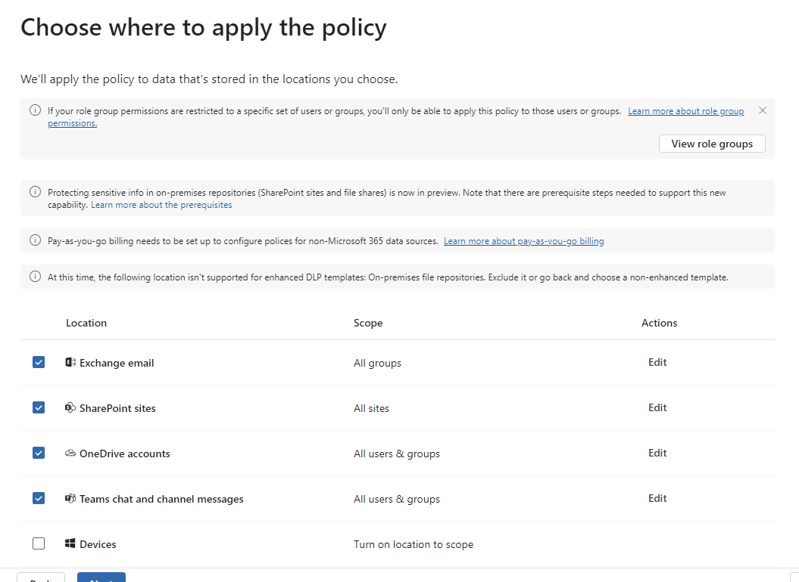
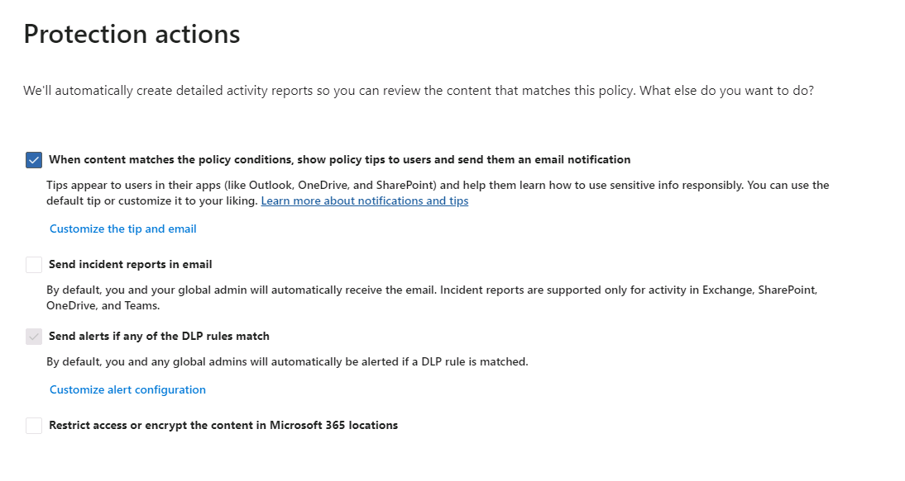
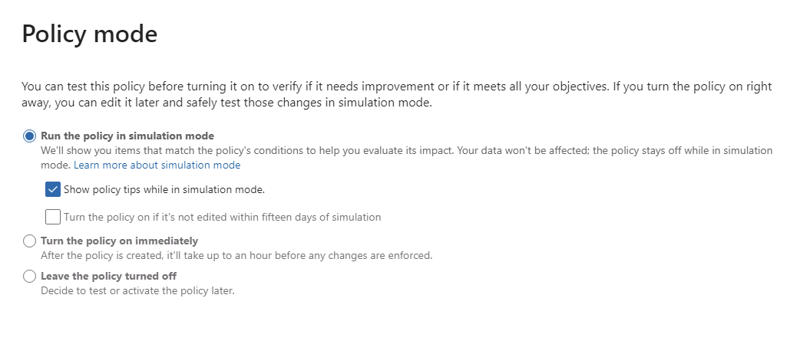
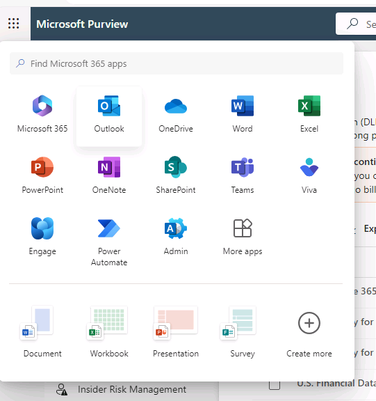
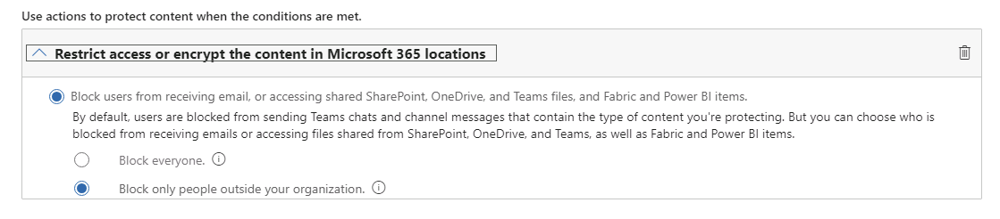

# Lab 05: Implementing Data Loss Prevention (DLP) in Microsoft Purview

> **Goal:** Plan, build, test, and monitor a Microsoft Purview DLP policy for Microsoft 365 workloads (Exchange Online, SharePoint/OneDrive, Teams).

**Estimated time:** 45-60 minutes

---

## Prerequisites

- **Licensing**
  - Cloud DLP for Exchange/SharePoint/OneDrive is available in Microsoft 365 E3; **Teams DLP and Endpoint DLP require E5 or E5 Compliance** (or trials).
- **Roles**
  - You need one of: **Compliance Administrator**, **Compliance Data Administrator**, **Information Protection Admin**, or **Security Administrator** to create DLP policies.
- **Portals & navigation**
  - **Microsoft Purview portal** (<https://purview.microsoft.com>) → **Data loss prevention** for policies and alerts.
  - **Data classification → Activity explorer** for detailed activity views (also available from the DLP page).
- **Audit (for alerts/activity)**
  - Ensure **Audit** is on: Purview portal → **Audit** → if prompted, select **Start recording user and admin activity** (may take up to 60 minutes to take effect).
- **Test accounts/content**
  - One **sender** (your admin account is fine) and one **external address** (e.g., a personal Gmail) to test email sharing.
  - Use the test data provided in the **Appendix** below to trigger the DLP policy created in this lab.
- **Optional**
  - For **Teams** file-sharing enforcement, remember Teams DLP acts on files via **SharePoint/OneDrive**—make sure those locations are included.

---

## Exercise 1 — Plan your policy

1. Draft a **policy intent statement** answering:
   - What data? (e.g., **Payment card data**)
   - Where? (Exchange, SharePoint/OneDrive, Teams)
   - What behaviors to restrict? (external sharing, emailing outside, copying to USB, printing, etc.)
   - User experience? (show **policy tips** first, then **block with override**, then **block**)
2. Map the intent to Purview DLP components: **Locations** (workloads), **Conditions** (Sensitive information types), **Actions** (block/override/audit), **User notifications**, and **Incident/alerting**.

> **Tip:** Start in **simulation** (test) mode with notifications, then move to enforcement after you validate matches.

---

## Exercise 2 — Review the Devices DLP Policy

1. In the **Microsoft Purview** portal, go to **Data loss prevention → Policies**.
2. Review the pre-existing set of policies in the sandbox environment (e.g., **Default policy for Teams** or **Default policy for devices**)
3. Check **Default policy for devices** and click the pencil icon (for edit)
4. Click **Next** on the "Name your DLP policy" page, leaving defaults
5. Click **Next** on the "Assign admin units" page, leaving defaults
6. On the "Choose where to apply the policy" page, note that only **Devices** is selected; click **Next**
7. On the "Customize advanced DLP rules" page, click the pencil icon next to one of the pre-defined rules
8. Review the rule definition, especially noting settings under the "Audit or restrict activities on devices" action
9. Take note of the types of actions you can manage relative to DLP with devices
10. Click **Cancel** and click **Cancel**

---

## Exercise 3 — Create a DLP policy (simulation mode)

1. In the **Microsoft Purview** portal, go to **Data loss prevention → Policies → Create policy**.
2. Click the plus sign (or "Create policy") to create a new policy from the DLP "Policies" page
3. On the "Choose what type of data to protect" page, leave the default of "Data stored in connected sources" selected and click **Next**
4. On the "Start with a template or create a custom policy" page, choose "Medical and health" under **Categories**, select "U.S. Health Insurance Act (HIPAA) Enhanced" under **Regulations**, and click **Next**
5. On the "Name your DLP policy" page, assign a name of your choosing (e.g., ```US HIPAA Policy```) and, optionally, modify the description; click **Next**
6. On the "Assign admin units" page, leave the default of "Full directory" under "Admin units" and click **Next**
7. On the "Choose where to apply the policy" page, **uncheck** everything **except for** "Exchange email", "SharePoint sites", "OneDrive accounts", and "Teams chat and channel messages"



8. Explore the "Edit" options next to each location to see what kinds of configuration you can assign for each location; however, don't make any changes (use **Cancel** to exit from the edit actions dialog)
9. Click **Next**
10. On the "Define policy settings" page, leave "Review and customize default settings from the template" selected and click **Next**
11. On the "Info to protect" page, leave "Detect when this content is shared from Microsoft 365" checked and verify that "With people outisde my organization" is selected; click **Next**
12. On the "Protection actions" page, use the following settings:



13. Click **Next**
14. On the "Customize access and override settings" page, leave all settings at their defaults and click **Next**
15. On the "Policy mode" page, leave "Run the policy in simulation mode" selected and check "Show policy tips while in simulation mode"



16. Click **Next**
17. On the "Review and finish" page, click **Submit**
18. Click **Done**

---

## Exercise 4 — Generate matches & see the end-user experience

### A. Outlook on the web (policy tips)

1. Open **Outlook on the web (OWA)** as the **sender** - you can use the admin account used to login to Purview
2. To navigate there, click the "9 Dots" in the upper-left in Purview and click "Outlook"



3. If prompted to login, use the admin credentials provided with the sandbox
4. Use an external email address (an address outside of the sandbox tenant) for the **To**
5. For subject, use "Latest Doctor's Visit"
6. In the body of the email, apply text similar to what you find in the **Appendix** below
7. Depending on the performance of the sandbox and sync status for the policy, you may see policy tips
8. If not, if you send the email, you should receive a notification about the policy violation

### B. OneDrive/SharePoint & Teams (file sharing)

1. In **OneDrive**, create a **Word document** “JaneDoe.docx” with the same test data from the **Appendix** below.
2. To navigate there, click the "9 Dots" in the upper-left in Purview and click "OneDrive"
3. Attempt to **share externally** (e.g., “Anyone with the link” or a specific external user).  
   - In **Teams**, share or attach the same file in a chat/channel.  
   - **Note:** Teams file protection relies on SharePoint/OneDrive being included in the policy.

---

## Exercise 5 — Review alerts & activity

> There can be a short delay before events appear. If you don’t see anything, wait a few minutes and refresh.

1. **Alerts:** Purview portal → **Data loss prevention → Alerts**.  
   - Open your new alert → **View details** → examine **Events** and try **Copy event link**.
2. **Activity explorer:**  
   - Purview portal → **Data loss prevention → Activity explorer** (or **Data classification → Activity explorer**).  
   - Filter by **Location**, **Policy/Rule**, **Action**, and **User** to see your test activities for the last 30 days.
3. **Data explorer:**
    - In Purview, navigate to **Settings** -> **Roles and scopes** -> **Role groups**
    - Search for "Content"
    - Add your admin account to **Content Explorer Content Viewer** and **Content Explorer List Viewer**
    - Log out and back in to Purview
    - Navigate to **Solutions** -> **Data Loss Prevention** -> **Explorers** -> **Data explorer**
    - Explore drilldown into flagged content

---

## Exercise 6 — Move to enforcement & retest

1. Navigate to **Solutions** -> **Data Loss Prevention** -> **Policies**
2. Check "US HIPAA Policy" and click the pencil icon (to edit)
3. Click **Next** x 3
4. On the "Customize advanced DLP rules" page, click the pencil icon next to the defined rule
5. Under **Actions**, click **Add an action** and click "Restrict access of encrypt content in Microsoft 365 locations"
6. Use the following settings:



7. Click **Save**
8. Click **Next**
9. On the "Policy mode" page, select "Turn the policy on immediately" and click **Next**
10. Click **Submit** and click **Done**
11. Attempt the same actions attempted in **Exercise 4**
12. Also, review the activity using the steps outlined in **Exercise 5**

---

## SC-100 Tie-in — Strategy & architecture (5–10 min)

- **Zero Trust pillars**  
  - **Identity** (Adaptive Protection ties user **risk** to controls),  
  - **Data** (DLP policies & labels),  
  - **Devices** (Endpoint DLP),  
  - **Apps** (Teams/SharePoint/OneDrive),  
  - **Network/Threat** (alerts feed investigations).
- **Adaptive controls**  
  - Risk-based DLP and Conditional Access can block downloads or access for elevated-risk users—strong example of **defense in depth**. (Entra ID P2 is required for the Conditional Access insider-risk condition.)

---

## Troubleshooting notes

- **Don’t see alerts/activity yet?** Short processing delays are normal; refresh after a few minutes. Verify **Audit** is turned on.
- **Policy tips didn’t appear?** Use **Outlook on the web** (supported). Other clients have varying support; for this lab, stick to OWA to validate behavior.
- **Teams file scenarios** require that **SharePoint/OneDrive** locations are included in your policy.

---

## Cleanup

1. Purview → **Data loss prevention → Policies**: set your policy to **Off** or delete it.
2. **Alerts**: resolve/close test alerts to keep dashboards clean.
3. If you onboarded devices for Endpoint DLP, offboard test devices when finished.

---

## What you should have by the end

- A documented **policy intent** tied to real DLP components.
- A working **DLP policy** in simulation and enforcement modes.
- Hands-on experience with **policy tips**, **alerts**, and **Activity explorer**.

---

### Appendix — Fast test content you can paste

```Text
Patient: Jane Doe
Address: 123 Any Street, Springfield, IL 62704
Diagnosis: Type 2 diabetes mellitus without complications (ICD-10-CM E11.9)
Plan: Follow-up in 3 months
```
