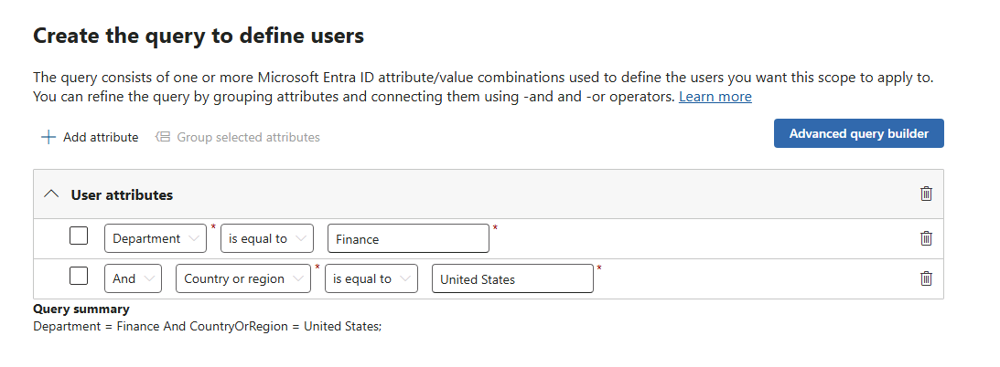

# Lab 06: Data Retention & Records Management in Microsoft Purview

Students will create static and adaptive retention policies, build adaptive scopes, configure event-based retention, complete a disposition review, and connect the design to SC-100 architecture considerations.

---

## 📌 Learning objectives

By the end of this lab, you will be able to:

- Create **static** and **adaptive** retention policies in Microsoft Purview.
- Build **adaptive scopes** (Users/Sites/Groups) and use them in policies and label publishing.
- Configure **event-based retention** (event types, labels, asset IDs, events).
- Run a **disposition review** (single or multi-stage) and export proof of disposition.
- Tie retention and records decisions to **data residency** and **regulatory** requirements (SC-100 context).

---

## 🧰 Prerequisites (instructor/tenant)

- Microsoft 365 test tenant with access to the **Microsoft Purview portal**.
- Roles:
  - **Compliance Administrator** (or equivalent) for policy/label configuration.
  - **Scope Manager** (or equivalent) for **Adaptive scopes**.
  - **Disposition Management** for reviewers (often via a dedicated **mail-enabled security group**, e.g., `Disposition Reviewers`).
- Licensing: Microsoft Purview **Records management** features (E5 or Purview solutions trial).
- A SharePoint site for the lab (e.g., `https://<tenant>.sharepoint.com/sites/RecordsLab`) with a **Documents** library.
  - Navigate to SharePoint using the "9 Dots" in the upper left
  - Click "Create site" and choose "Team site"
  - For template, use "Standard team" on the "From Microsoft" tab
  - Click **Use template**
  - Give the site a name (e.g., "key-documents") - use other defaults and click **Next**
  - Use the defaults for "Privacy settings" and "Select a language" and click **Create site**
  - Add the administrator account (MOD Administrator), add Adele Vance, and add Diego Siciliani (member of the Finance Team); click **Finish**
  - Click **Documents** and upload 2-3 sample files (.docx and .txt) - you can create the .txt file locally and upload; you can use the **New** button in the SharePoint document library to create a new Word document

> **Propagation timing note**  
> Retention policies, label publishing, and event synchronization can take time to deploy.

---

## 🧭 Scenario used in this lab

**Contoso Finance**

- Teams **chats** for Finance users: retain **3 years** and then delete.
- All SharePoint/OneDrive content: retain **7 years** and then delete.
- HR records: labeled as **records** and require a **2-stage disposition**.
- Offboarding: **event-based retention** triggered by an **Employee Separation** event using an **Asset ID** (employee ID).

---

## Part A — Static retention policy for SharePoint & OneDrive (7 years)

1. Go to **Microsoft Purview portal** → **Solutions** → **Data Lifecycle Management** → **Policies** → **Retention policies** → **New retention policy**
2. On the "Name your retention policy" page, assign a name of your choosing (e.g., "Global SPO/OD Retain 7y"); click **Next**
3. On the "Policy Scope" page, leave the default at "Full directory" and click **Next**
4. On the "Choose the type of retention policy to create", choose **Static** and click **Next**
5. The following locations only should be enabled: **SharePoint classic and communication sites** and **OneDrive accounts**; verify and click **Next**
6. On the "Decide if you want to retain content, delete it, or both", select "Retain items for a specific period"
7. Use "7 years" for the retention period
8. Use "When items were created" for retention period start basis
9. For "At the end of the retention period", select "Delete items automatically"
10. Click **Next**
11. On the "Review and finish" page, click **Submit** then click **Done**

> **Tip**: Teams **files** are stored in SharePoint/OneDrive and are covered by SharePoint/OneDrive retention. Teams **messages** require their own locations in a separate policy.

---

## Part B — Adaptive scopes + adaptive Teams chats policy (3 years)

### B1. Create an **adaptive scope** (Users)

1. In the Purview portal, select **Settings** (gear) → **Roles and scopes** → **Adaptive scopes** → **+ Create scope**.
2. On the "Name your adaptive policy scope" page, assign a name of your choosing (e.g., "UserScope-Finance-US"); click **Next**
3. Leave the default of "Full directory" on the "Assign admin unit" page and click **Next**
4. On the "What type of scope do you want to create?" page, select "Users" and click **Next**
5. On the "Create the query to define users" page, use the following:

6. Click **Next**
7. On "Review and finish", click **Submit**
8. If you encounter any errors, edit the scope, click **Next** through the steps until you reach the "Review and finish" page and try **Submit** again
9. Click **Done**

> **About adaptive scopes**: They evaluate daily against Entra ID/SharePoint attributes and keep policy/label targeting current as people or sites change—no manual includes/excludes.

### B2. Create an **adaptive** retention policy for **Teams chats** (3 years)

1. **Solutions** → **Data Lifecycle Management** → **Policies** → **Retention policies** → **New retention policy**
2. On the "Name your retention policy" page, assign a name of your choosing (e.g., "Teams Chats (Finance US) Retain 3y"); click **Next**
3. On the "Policy Scope" page, leave the default of "Full directory" under "Admin Units" and click **Next**
4. On the "Choose the type of retention policy to create", select "Adaptive" and click **Next**
5. On the "Choose adaptive policy scopes and locations", click **Add scopes** and select the previously created scope; click **Add**
6. For locations, select **Teams chats** only - leave all others off and click **Next**
7. On the "Decide if you want to retain content, delete it, or both", select "Retain items for a specific period"
8. Use **Custom** and "3 years" for the retention period
9. Use "When items were created" for retention period start basis
10. For "At the end of the retention period", select "Delete items automatically"
11. Click **Next**
12. On the "Review and finish" page, click **Submit** then click **Done**

---

## Part C — Records management labels with disposition

We’ll create a label that **marks items as records** and uses **2-stage disposition**.

### C1. Create a **retention label** (record, 2-stage disposition)

1. **Solutions** → **Records Management** → **File plan** → **+ Create a label**
2. On the "Name your retention label" page, assign a name of your choosing (e.g., "HR-Record-2y-2StageDisp")
3. Optionally add descriptions and click **Next**
4. On the "Define file plan descriptors for this label" page, you can leave all values blank and click **Next**; see <https://learn.microsoft.com/en-us/purview/file-plan-manager#file-plan-descriptors-columns> for more information on these settings
5. On the "Define label settings" page, choose "Retain items forever or for a specific period" and click **Next**
6. On the "Define retention period" page, choose **Custom** and specify 2 years
7. For "Start the retention period based on", use "Employee activity" and click **Next**
8. On the "Choose what happens during the retention period" page, select "Mark items as a record" and click **Next**
9. Select "Start a disposition review"
10. Click **Create stages and assign reviewers**
11. Leave "Automatic stage approval" off and click **Add a stage**
12. Assign the stage a name (e.g., "Executives Review"); click **OK**
13. For "Reviewers for this stage", search for and select **Patti Fernandez**
14. Click **Add another stage**
15. Assign the stage a name (e.g., "Legal Review"); click **OK**
16. For "Reviewers for this stage", search for and select **Grady Archie**
17. Click **OK**
18. Click **Next**
19. On the "Review and finish" page, click **Create label**
20. When presented with the "Your retention label is created" page, select "Publish the label to Microsoft 365 locations" and click **Done**
21. On the "Choose labels to publish", leave the current selection and click **Next**
22. For "Policy Scope", leave the default of "Full directory" under **Admin Units**; click **Next**
23. On the "Choose the type of retention policy to create", select "Static" and click **Next**
24. On the "Choose where to publish labels" page, click **All locations** and click **Next**
25. On the "Name your policy" page, assign a name of your choosing (e.g., "Employee Exit"); click **Next**
26. On the "Finish" page, click **Submit** and then **Done**

### C2. Apply the label to SharePoint documents

1. In the SharePoint site created earlier, navigate to the **Documents** library
2. Click the 3 dots (for **More Actions**) next to 1 of the files, navigate to **More**, and **Compliance Details**
3. Unfortunately, in the sandbox, the retention labels are likely not available but this is where you would the label (and associated stage)
4. Click **Close** and return to the Purview portal

---

## Part D — Event-based retention (Offboarding)

You’ll create an event-based label, publish it, apply it to a document, set an **Asset ID**, and then trigger an **Event**.

### D1. Create an **event-based** retention label

1. **Solutions** → **Records Management** → **File plan** → **+ Create a label**
2. On the "Name your retention label" page, assign a name of your choosing (e.g., "HR-Offboarding-Event-1d-Disp"); click **Next**
3. Leave the settings on the "Define file plan descriptors for this label" page unset and click **Next**
4. On the "Define label settings" page, choose "Retain items forever or for a specific period" and click **Next**
5. On the "Define the retention period" page, choose **Custom** and 1 day under "Retain items for"
6. For "Start the retention period based on", choose **Create new event type**
7. Use "Employee Separation" for the event type name and click **Next**
8. On the "Summary" page, click **Submit** then click **Done**
9. Select the new "Employee Separation" event type for "Start the retention period based on" and click **Next**
10. On the "Choose what happens during the retention period" page, select "Retain items even if users delete" and click **Next**
11. On the "Choose what happens after the retention period" page, select "Start a disposition review" and click **Create stages and assign reviewers**
12. Leave "Automatic stage approval" off and click **Add a stage**
13. Assign the stage a name (e.g., "Executives Review"); click **OK**
14. For "Reviewers for this stage", search for and select **Patti Fernandez**
15. Click **Add another stage**
16. Assign the stage a name (e.g., "Legal Review"); click **OK**
17. For "Reviewers for this stage", search for and select **Grady Archie**
18. Click **OK**
19. Click **Next**
20. On the "Review and finish" page, click **Create label**
21. When presented with the "Your retention label is created" page, select "Publish the label to Microsoft 365 locations" and click **Done**
22. On the "Choose labels to publish", leave the current selection and click **Next**
23. For "Policy Scope", leave the default of "Full directory" under **Admin Units**; click **Next**
24. On the "Choose the type of retention policy to create", select "Static" and click **Next**
25. On the "Choose where to publish labels" page, click **All locations** and click **Next**
26. On the "Name your policy" page, assign a name of your choosing (e.g., "Employee Separation"); click **Next**
27. On the "Finish" page, click **Submit** and then **Done**

### D2. Apply the label and set an **Asset ID** on a document

1. In the SharePoint site created earlier, navigate to the **Documents** library
2. Click the 3 dots (for **More Actions**) next to 1 of the files, navigate to **More**, and **Compliance Details**
3. Typically, you would apply a label (e.g., the "HR-Offboarding-Event-1d-Disp" label)
4. For SharePoint/OneDrive, in the **Asset ID** field, you can enter a specific ID (e.g., "EID-1001")
5. Unfortunately, in the sandbox, the retention labels are likely not available but this is where you would the label (and associated stage)
6. Click **Close** and return to the Purview portal

> **Note**: If the Asset ID field is read-only, ensure an **event-based** retention label is applied first.

### D4. Trigger an **Event** to start retention

1. Back in the Purview portal, use **Solutions** → **Records Management** → **Events** → **+ Create**
2. On the "Name the event" page, assign a name of your choosing (e.g., "Employee Separation Event") and click **Next**
3. On the "Event settings" page, choose "Use existing labels", click **Choose a label**, check "HR-Offboarding-Event-1d-Disp", and click **Add**
4. Click **Next**
5. On the "Event settings" page, under "Asset IDs for items in SharePoint and OneDrive", enter "EID-1001" and click **Next**
6. On the "Finish" page, click **Submit** then **Done**

---

## Part E — Disposition review (reviewers’ experience)

> Use pre-staged items so you can demonstrate items ready for disposition.

1. On the Purview portal, use **Solutions** → **Records Management** → **Disposition**.
2. If labels were immediately available and could be assigned in "Compliance Details" for a document in SharePoint for example, you could select a disposition to review metadata and (if permitted via **Content Explorer Content Viewer**) preview content
3. You could also choose an action: **Dispose (delete)**, **Extend**, **Relabel**, or **Export proof of disposition**.

---

## Part F — Validate and troubleshoot

- **Policy/label status**:  
  - **Data Lifecycle Management** → **Policies** → **Retention policies** → open a policy to view deployment status
  - **Records Management/Data Lifecycle Management** → **Policies** → **Label policies** for publishing status
- **Common blockers**:
  - Propagation delays (policy/label/event distribution)
  - Missing roles (e.g., **Disposition Management** for reviewers, **Content Explorer Content Viewer** for previews)
  - Using static scopes where adaptive scopes would reduce include/exclude limits

---

## Part G — Clean up (optional)

- Disable or delete demo **retention policies** and **label policies**.  
- Delete demo **labels** (only if unused and not regulatory/event-based).

---

## SC-100 tie-in: Residency, retention, and regulatory alignment

- **Data residency**: Design for where data at rest resides (e.g., multi-geo). Confirm which Purview data is stored in which regions and align to regulatory constraints.  
- **Retention as a control**: Map your policies/labels to obligations (e.g., SEC/FINRA/GDPR) using **Compliance Manager** assessments and templates.  
- **Operating model**: Prefer adaptive scopes for scale, mail-enabled security groups for disposition reviewers, and clear RBAC separation of duties.

---

## Quick UI path cheat sheet

- **Retention policies** (static/adaptive): **Solutions → Data Lifecycle Management → Policies → Retention policies**  
- **Adaptive scopes**: **Settings → Roles and scopes → Adaptive scopes**  
- **Retention labels (File plan)**: **Solutions → Records Management → File plan → + Create a label**  
- **Publish labels** (label policies): **Solutions → Records Management** or **Data Lifecycle Management → Policies → Label policies → Publish labels**  
- **Events** (event types & events): **Solutions → Records Management → Events**  
- **Disposition**: **Solutions → Records Management → Disposition**
