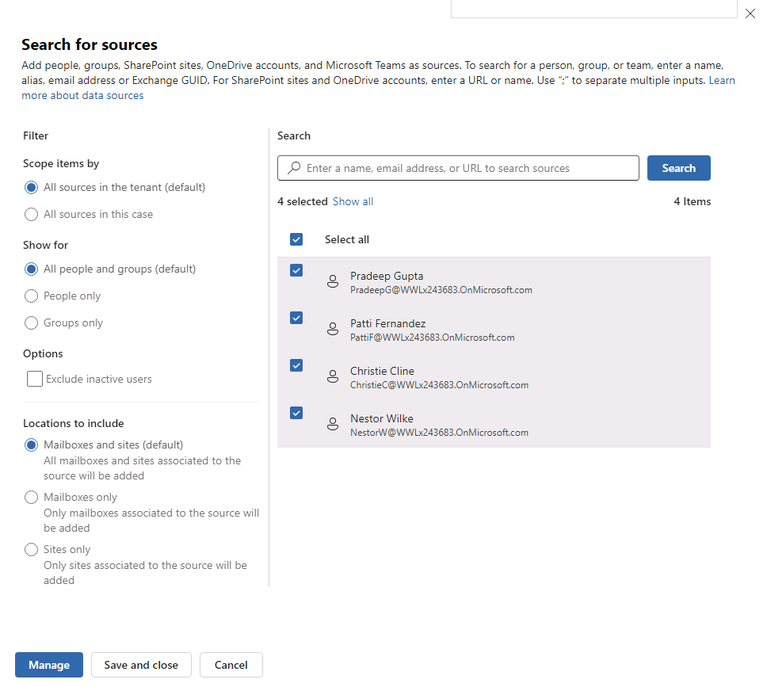
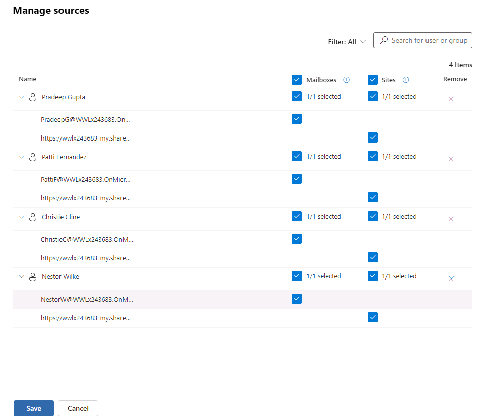
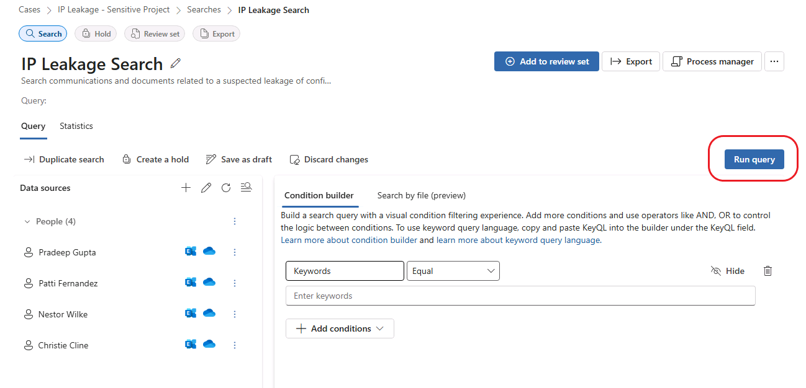
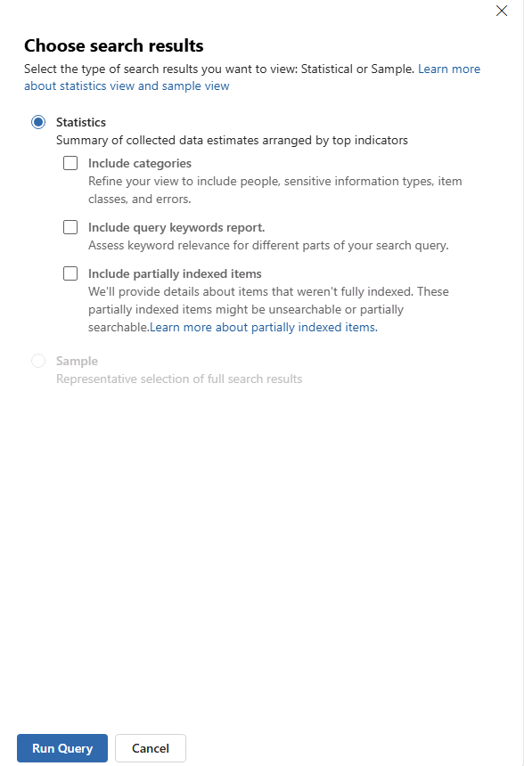
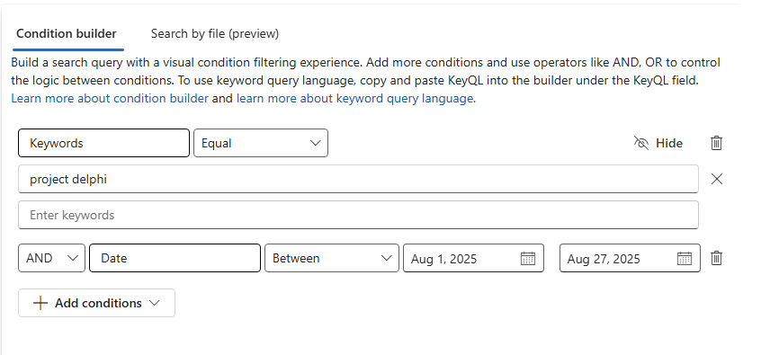
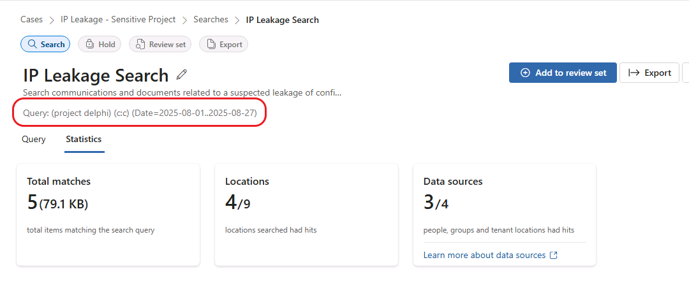
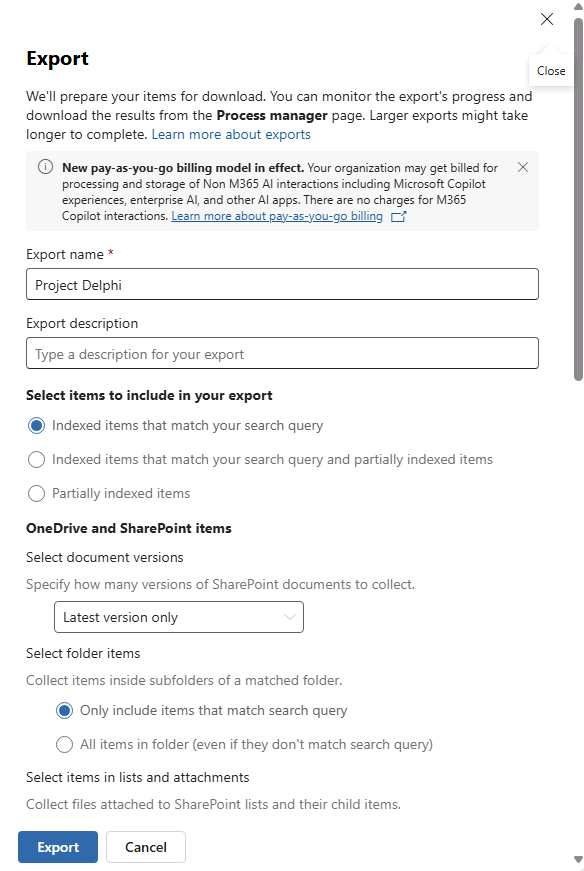

# Lab 07 - Creating an eDiscovery Case in Microsoft Purview

- Login to <https://purview.microsoft.com>
- In the left-hand menu, select Solutions | eDiscovery
- If not taken there automatically, select Cases and click "Create case"
- Assign a name to your case (e.g., "IP Leakage - Sensitive Project")
- Optionally apply a description (e.g., "Execute and process scans for leakage of intellectual property data associated to Project Delphi")
- Click "Create"
- After the case has been created, click "Cases" in the top-level breadcrumb to return to the "Cases" dashboard
- Review the dashboard including the various attributes associated to each case
- Notice the "Delete case" and "Close case" option for each case (you can see when clicking the 3 dots next to the case name)
- Click the case to drill down into case details
- Click "Case settings" to review (and adjust if required) the case's configuration
  - On the "Case details" tab, make sure "eDiscovery (Premium)" is turned on
  - Review the "Permissions" tab where you can add users and role groups for case access (note that the case create - MOD Administrator - is already added)
  - Review the "Data sources" tab - here you can configure scope for the assignment of data sources; you can leave all unchecked
  - Review the "Search & analytics" tab - here you can configure ML/AI-related functions that can be leverage to make sure your searches more "intelligent"
  - Review the "Review sets" tab - here you can configure whether or not automatica grouping should be used to assist with the organization of findings in a review set
- Close the settings (using the X in the upper right corner) and click "Create a search"
- Assign a name to the search (e.g., "IP Leakage Search")
- Optionally apply a description (e.g., "Search communications and documents related to a suspected leakage of confidential intellectual property detail on Project Delphi")
- Click "Create"
- Click "Add sources" to add specific sources to the search (alternatively, you could use "Add tenant-wide sources" to add tenant-wide sources)
- Select test users for inclusion (e.g., Pradeep Gupta, Patti Fernandez, Christie Cline, and Nestor Wilke); configure settings as follows:

- Click "Manage" to define the data sources for this set of users that will be searched as part of the case; configure as follows:

- Click "Save"
- Use an "InPrivate" window to log in as the different users you included as case sources
  - User logins include pradeepg@<your-tenant>, pattif@<your-tenant>, nestorw@<your-tenant>, and christiec@<your-tenant>
  - You can use a separate user (e.g., meganb@<your-tenant>) for someone not included in the search/investigation
  - All users will have the same password (the user password)
  - Send Teams messages to/from each user (some with the phrase "Project Delphi" included and others without)
  - Send emails to/from each user (some with the phrase "Project Delphi" included and others without)
  - Create documents in each user's OneDrive (some with the phrase "Project Delphi" included and others without)
- From the "IP Leakage Search" Query page, click "Run query" using the default settings for "Choose search results":

- Click "Run Query"
- The search may take a few minutes to complete
- Review the results on the "Statistics" tab
- You'll see that the search has pulled everything from each user's mailbox and OneDrive location
- Click the "Query" tab
- Use a keyword search as follows - use the "Add conditions" and the "Date" type to specify the date parameters:

- Click "Run query" and click "Run Query" from the "Choose search results" dialog
- After a few minutes, the search should complete
- Review the updated statistics on the "Statistics" tab to see what's changed
- Notice the query definition at the top of the page - this is KeyQL:

- Export the search results and review the resulting artifact(s)
- Click "Export" near the top of the search page
- In the resulting dialog, give your export a name (e.g., "Project Delphi")
- Explore the various options that are available for defining the export but leave them at their defaults:

- Click "Export"
- Click "Process manager" to track progress of the export
- Click "Refresh" - eventually the status should switch from "In Progress" to "Completed"
- Once complete, click the export line item
- In the resulting dialog, click "Download" (during testing, the sandboxed environments had issues with pop-ups and the download)
