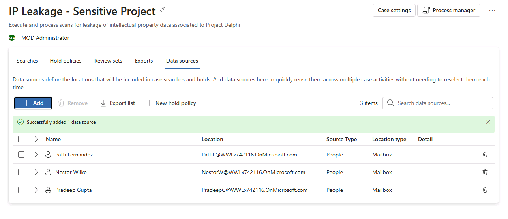
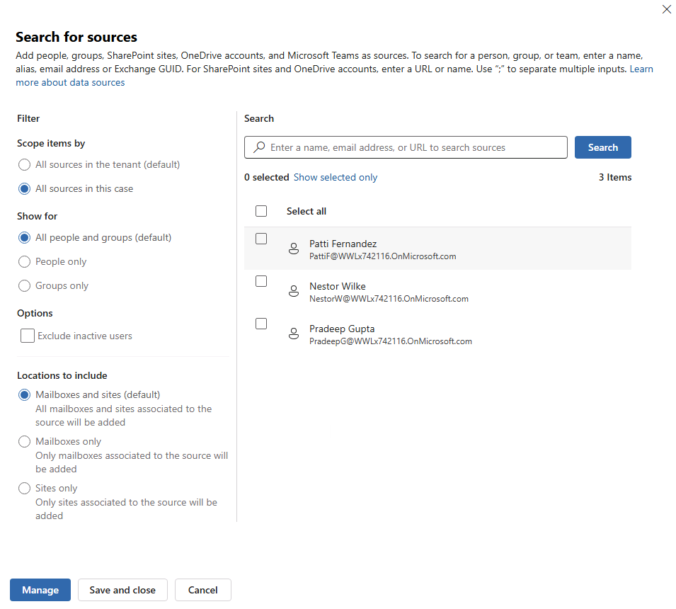
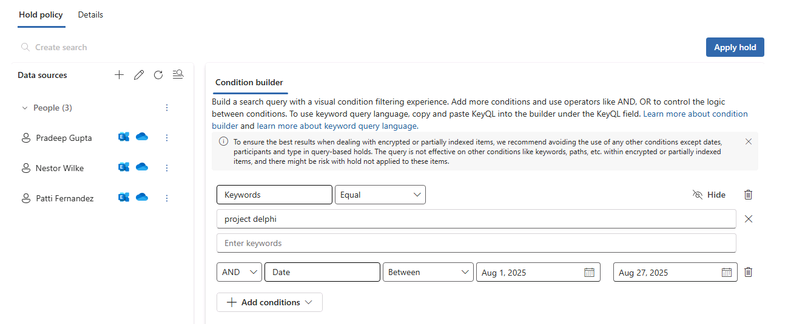
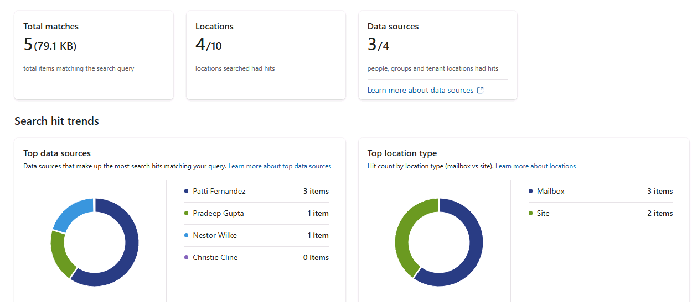
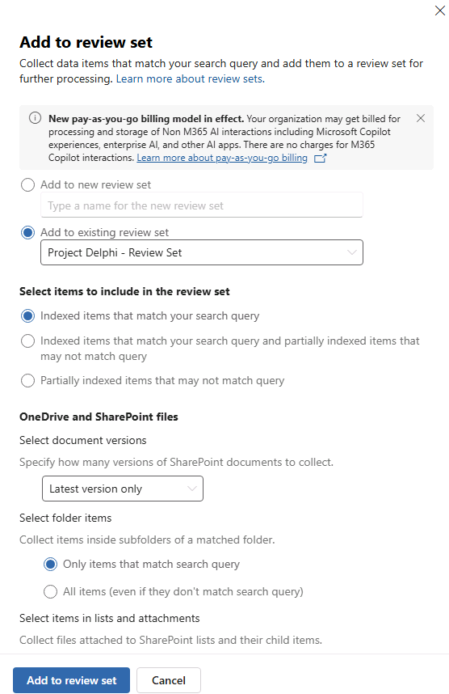

# Lab 08 - Applying and Testing Hold Policies in an eDiscovery Case

- Assumes completion of Lab 07
- Login to <https://purview.microsoft.com>
- In the left-hand menu, select Solutions | eDiscovery | Cases
- Select the "IP Leakage - Sensitive Project" case created in Lab 07
- Explore each tab at the top of the page:
  - "Searches" is where you define targeted searches across specific data sources
  - "Hold policies" is where you define hold policies to preserve content potentially relevant to the case
  - "Review sets" is where you organize, collect, and complete additional analysis on items before executing the export
  - "Exports" is where you can see the status of any previous or in-progress export operations
  - "Data sources" is where you can define data sources (investigation targets) at the case level for reuse across different components of the case
- Click "Data sources" and click "Add"
- Select 3 of the 4 users used in Lab 07 (e.g., Pradeep Gupta, Patti Fernandez, and Nestor Wilke); **NOTE:** It doesn't have to be same set of users as you used in previous searches
- Click "Add"
- From the "Data sources" tab, click "New hold policy" (or, alternatively, you can click "Hold policies" and define there):

- For "Hold policy" details, assign a name of your using (e.g., "Project Delphi-Related Holds"), optionally provide a description, and click "Create"
- In "Hold policy" definition page, click "Add sources"
- Under "Filter", if you click "All sources in this case", it should show just the 3 sources defined at the case level

- Click "Manage"
- Leave all defaults and click "Save"
- In "Condition builder", use the same query used in Lab 07

- Click "Apply hold"

- The application of the hold may take a few minutes
- Testing Preservation (Goal: Attempt deletions and show that held items cannot be permanently removed)
  - Return to the search defined in Lab 07 and rerun the Query
  - Take note of the statistics:

- Email Deletion Test
  - Delete an email previously retrieved in a search, then empty their Deleted Items folder
  - Back in Purview, rerun a Search scoped to that mailbox and looking for a specific keyword (you can wait to run the search after all deletions if you prefer)
  - Result: The deleted email should still appear in search results to show that hold preserved it
  - **Actual result in sandbox:** Holds may take 24 hours to take affect, so the search results may appear different (you should see the preserved doc in the review set steps below)
- OneDrive File Deletion Test
  - Delete a file from OneDrive and then remove it from the Recycle Bin
  - In Purview, run a search scoped to that OneDrive location (you can wait to run the search after all deletions if you prefer)
  - Result: The file should still surface to show that hold has preserved a copy
  - **Actual result in sandbox:** Holds may take 24 hours to take affect, so the search results may appear different (you should see the preserved doc in the review set steps below)
- Teams Chat Deletion Test
  - In a Teams client, delete a chat message in scope of the hold
  - Because chat messages are stored in the user’s mailbox, rerun your mailbox search (you can wait to run the search after all deletions if you prefer)
  - Result: The deleted chat message should still be returned
  - **Actual result in sandbox:** Holds may take 24 hours to take affect, so the search results may appear different (you should see the preserved doc in the review set steps below)
- Create a Review Set
  - In your case, go to the Review sets tab and click "Create review set"
  - Enter a name (e.g., "Project Delphi - Review Set") and optional description
  - Click "Add"
  - The new Review set should appear in the list
- Add Search Results to the Review Set
  - Switch to the Searches tab, and select your previous search ("IP Leakage Search")
  - Click "Add to review set"
  - Choose Add to existing review set, and select the review set by name
  - Leave all other settings at their defaults and click "Add to review set":

- After a few minutes the review set compilation should complete - you can also track progress using "Process manager"
- You can see the preserved documents, including drilling down into their content
- Run Analytics: Duplicate Detection & Themes
  - Open the review set
  - From the toolbar, select Analytics > Run document & email analytics
  - This will use the "Search & analytics" settings defined for the case
  - Wait for the job to complete (check "Process manager" to track)
  - Once complete, you can view the results using the "Show reports" option under the "Analytics" heading
- Explore the options available under the dropdown in the "Actions" option at the top of the table
- You can also use "Tag files" to tag documents for cataloging and organization
- Finally, you can group items using the dropdown in the "Group" option at the top of the table
- Additional Review Set Actions
  - Email Threading: Group conversations so reviewers see full context.
    - Action: Collapse threads, then bulk-tag entire threads as “Reviewed” once any item in the thread has been coded
  - Tagging & Coding:
    - Create custom tags (e.g., Privilege, Responsive, Non-Responsive)
    - Apply tags to single or multiple items, then export tag reports
  - Saved Queries:
    - Save common filters (e.g. file type, date range, custodian) as reusable filter queries
  - Export:
    - Export only items tagged “Responsive” for production, with deduplication turned on to avoid redundant copies
- Discussion Points
  - Hold Scope: A single hold on mailboxes covers both email and Teams chats
  - Data Retention vs. Hold: Holds preserve items even if retention policies allow deletion
  - Performance Considerations: Large holds can impact indexing time; discuss strategies like scoped queries
