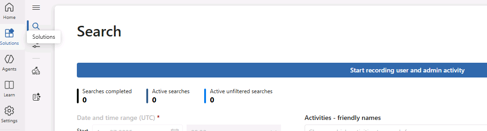

## Lab 09: Configure Communication Compliance & Create Two Policies (SITs + Inappropriate Text)

### Lab goals
By the end of this lab, students will be able to:
- Verify prerequisites and assign the correct role groups for Communication Compliance (CC).
- Configure privacy behavior and create a reusable coaching **notice template**.
- Create **two** CC policies that monitor Teams and Exchange:
  1. **Sensitive Information** (uses Sensitive Information Types / SITs)
  2. **Detect Inappropriate Text** (uses Microsoft’s built-in classifiers such as Harassment/Threat/Profanity)
- Seed example content for matches and understand detection/alert timelines.

### Roles/actors used in this lab
- **Admin:** Member of *Communication Compliance Admins* (configures policies).
- **Reviewers:** Members of *Communication Compliance Analysts* or *Communication Compliance Investigators* and **added as Reviewers in each policy** (investigate/remediate).
- **Senders:** 2–3 test users who will send Teams chats/emails to trigger matches.

### A. Enable auditing
1. Navigate to **Solutions** → **Audit**
2. Click the **Start recording user and admin activity** button at the top of the screen

### B. Configure privacy + create a notice template
1. **Privacy**
   - In **Settings** → **Communication Compliance** → **Privacy**:
     - Keep **Show anonymized versions of usernames** **On** for class demos

2. **Notice template**
   - **Settings** → **Communication Compliance** → **Notice templates** → **Create**:
     - **Template name:** `Coaching – Sensitive Info`
     - **Send from:** `MOD Administrator`
     - **Subject:** “Reminder: avoid sending sensitive numbers in chat/email”
     - **Body:** Provide friendly guidance, policy link, and where to ask questions. Use demo text of your own choosing.
   - Click **Create** then **Close**

### C. Create Policy #1 — Sensitive Information (Teams + Exchange)
1. **Create policy**
   - **Solutions** → **Communication Compliance** → **Policies** → **Create policy**.
   - Choose **Detect sensitive info types** template (policy type).

2. **Policy name:** `CC – Sensitive Info (Teams and Email)`

3. **Users and reviewers**
   - **Users or groups in scope** - Click **Select users** and select a small group (e.g., 2–3 test senders - you can use Allan Deyoung and Adele Vance, or choose your own test senders)
   - **Reviewers:** Add your designated reviewer(s) (must have EXO mailboxes - use MOD Administrator)

4. **Sensitive info to detect**
   - Click **Add sensitive info or keyword dictionary**
   - Search for and select **U.S. Social Security Number (SSN)** and check
   - Search for and select **ABA Routing Number** and check
   - Click **Add**

5. Click **Create policy** then **Close**

6. **(Optional) Validate condition logic immediately**
   - Click **Refresh**
   - You may not be able to test immediately (if policy still shows status of **Activating**)
   - Once fully activated, you could check the newly created policy and click **Test policy conditions** (icon looks like a beaker)

### D. Create Policy #2 — Detect Inappropriate Text (Teams + Exchange)
1. **Create policy**
   - **Policies** → **Create policy** → choose **Detect inappropriate text**

2. **Policy name:** `CC – Inappropriate Text (Teams and Email)`

3. **Users and reviewers**
   - **Users or groups in scope** - Click **Select users** and select a small group (e.g., 2–3 test senders - you can use Allan Deyoung and Adele Vance, or choose your own test senders)
   - **Reviewers:** Add your designated reviewer(s) (must have EXO mailboxes - use MOD Administrator)

5. Click **Create policy** then **Close**

6. **(Optional) Validate condition logic immediately**
   - Click **Refresh**
   - You may not be able to test immediately (if policy still shows status of **Activating**)
   - Once fully activated, you could check the newly created policy and click **Test policy conditions** (icon looks like a beaker)

### E. Review Trainable Classifiers
1. For the inappropriate text policy, click the settings icon next to the policy (it looks a set of switches on a sound board)

2. Revew **Policy Settings**
   - Under **Conditions**, notice the trainable classifiers associated to the policy (Targeted Harassment, Threat, Discrimination)
   - If policy activation was complete, you could also test the policy here using **Test policy conditions**
   - Click **Close**

> **Tip on timing:** Body content in Teams/email is typically evaluated on an hourly cadence after policy creation; attachments and image OCR can take longer (up to a day).

3. Review **Trainable Classifiers**
   - **Communication Compliance** → **Classifiers** → **Trainable classifiers**
   - Scroll through the list - you'll be able to find versions for Targeted Harassment, Threat, and Discrimination in multiple languages
   - Find any one of the policies (for English) in the list and click the **Open in new window** icon next to it
   - If you click **Test**, you're able to upload a file to test for a hit - however, the rules that dictate a "hit" are not known and you'll want to be careful with the kind of testing you do

### F. Explore the Dashboard
1. **Communication Compliance** → **Reports**

2. Toward the bottom (under **Detailed reports**) you can find additional reports (use **View Details** to access)
